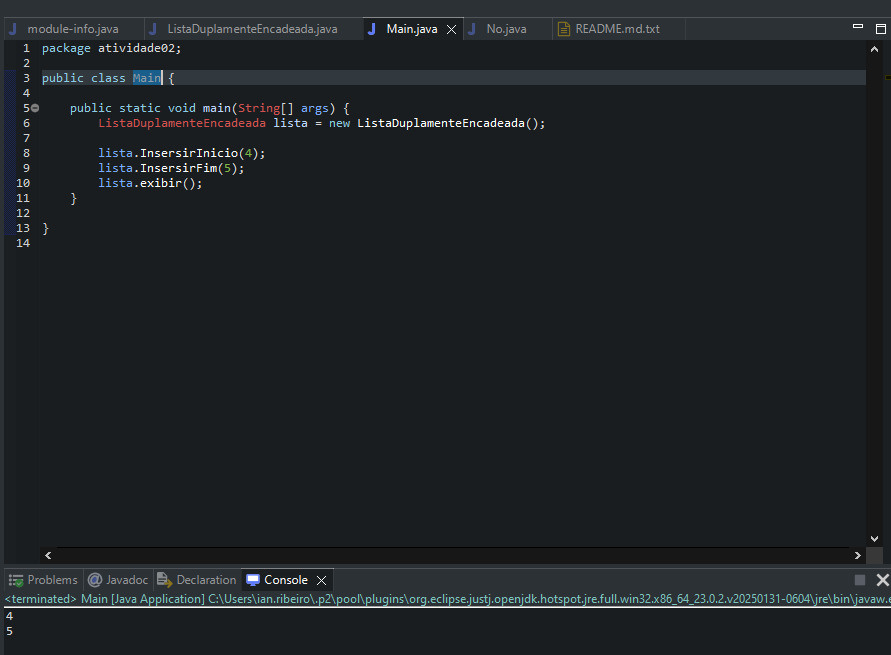

Lista Duplamente Encadeada - Inserção de Números

Este projeto em Java demonstra o funcionamento básico de uma lista duplamente encadeada, com foco na inserção de números inteiros tanto no início (à esquerda) quanto no final (à direita) da lista.

 Funcionalidades

- Inserção de elementos à esquerda(início da lista)
- Inserção de elementos à direita (fim da lista)
- Impressão dos elementos da lista em ordem

Objetivo Educacional

Este código faz parte dos exercícios da disciplina de Estrutura de Dados do curso de Análise e Desenvolvimento de Sistemas, com o objetivo de compreender:

- A estrutura e funcionamento de listas duplamente encadeadas
- Manipulação de ponteiros (nó anterior e próximo)
- Inserção em diferentes posições da lista

 Execução

Tecnologias Utilizadas

- Java (sem bibliotecas externas)
- Programação orientada a objetos (POO)

