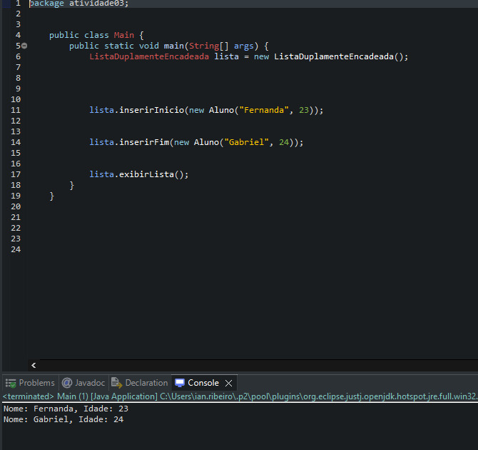

Atividade 03 - Cadastro de Alunos com Lista Duplamente Encadeada

Descrição
Programa que cadastra 5 alunos com nome e idade, e posteriormente insere mais dois alunos (um no início e outro no fim), utilizando lista duplamente encadeada.

Funcionalidades
- Cadastro de alunos.
- Inserção no início e no fim da lista.
- Exibição da lista final com os 7 alunos.

Execução

Tecnologias
- Java
- Estrutura de Dados: Lista Duplamente Encadeada
